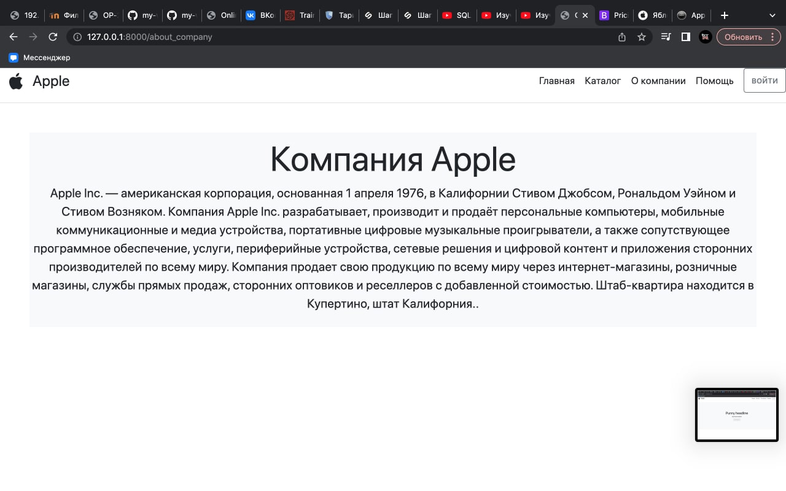

# Разработка сайта

## Техническое задание

Создать пробный веб-сайт с использованием Django для демонстрации ьазовых навыков разработки веб-приложений

## Результат работы

Данный проект представляет собой веб-сайт, созданный на базе Django с реализованной минимальными и базовыми функциями, дизайном. Проект еще до конца не доделан.

## Требования

1. Отображение информации на веб - страницах
2. Страницы сайта
   - Главная
   - Каталог
   - О компании
   - Помощь
   - Авторизация пользователя
3. Аутентификация и авторизация
   - Реализовать систему аутентификации и авторизации на базе Django
   - Разграничить доступ к станицам в зависимости от статуса пользователя(гости, авторизированные пользователи)
4. Тестирование
   - Провести тестирование каждой функции и страницы на сайте.